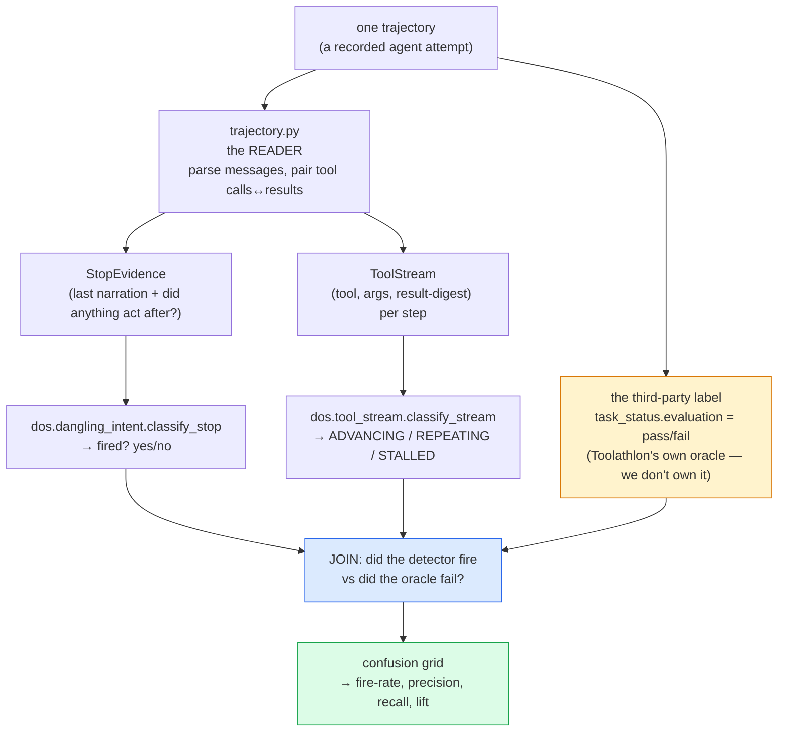
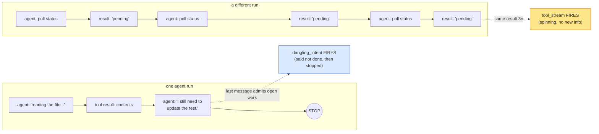
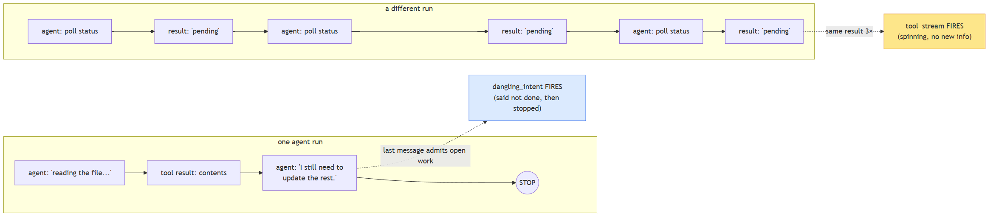
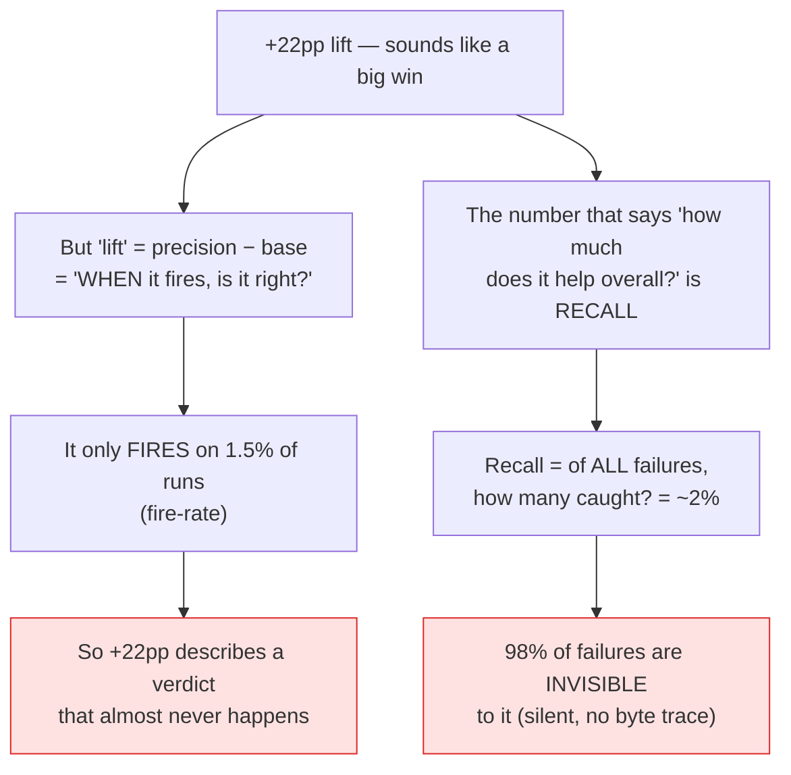
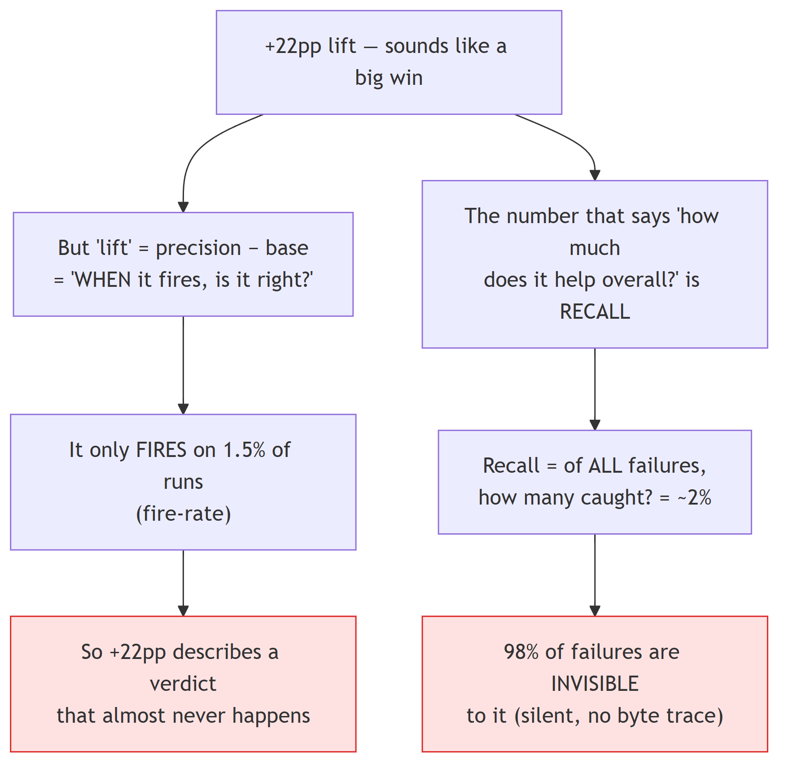
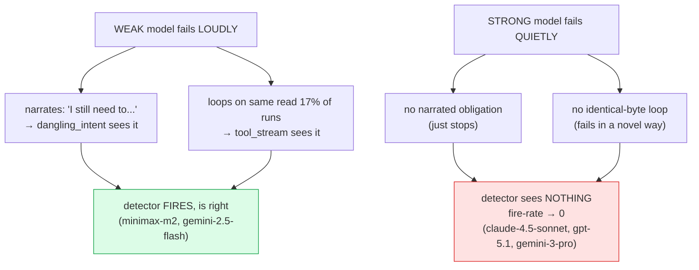
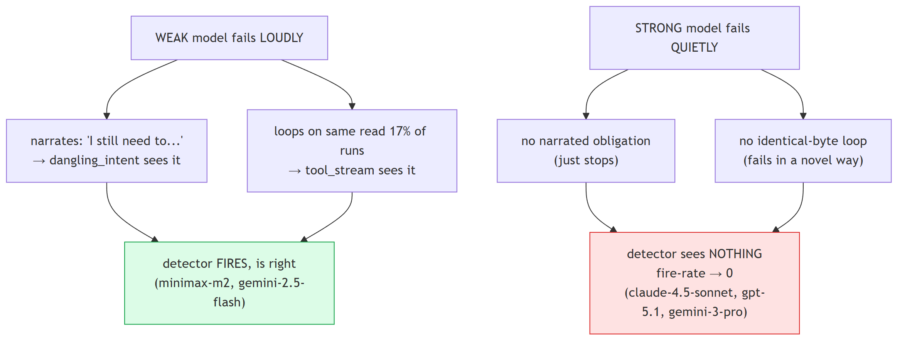

# How the Toolathlon replay works — terms, flow, and the "why doesn't the lift carry over?" answer

A plain-language companion to `docs/157` for someone who has NOT read the kernel. It defines the
basic terms, shows how the pieces flow together (Mermaid diagrams), and answers the one question the
headline numbers provoke: *if `dangling_intent` gets a +22pp lift, why doesn't that carry over into a
benchmark win?*

---

## 1. Basic terms (read this first)

> This is the *quick* table (replay mechanics). For the **full** reference — including the
> evidence-ladder vocabulary (`byte-author`, `forgeable`, `net-new`, `additivity`, the `frontier`
> cut, `SSOT`) that `docs/158` and the additivity ledger use — see **`GLOSSARY.md`** in this
> directory.

| Term | What it means, plainly |
|---|---|
| **Toolathlon** | An external benchmark (ICLR 2026): 108 long-horizon tasks where an AI agent must use 600+ real tools across 32 apps (Gmail, Notion, k8s, WooCommerce…). Hard — the best model passes <40%. |
| **trajectory** | The full recorded transcript of one agent attempt at one task: every message, every tool call, every tool result. The published dataset has 7,116 of them (22 models × 3 runs × ~108 tasks). |
| **the third-party oracle** | Toolathlon's OWN pass/fail judge (`evaluation/main.py`). It reads the *real app state* after the run (did the email actually send? is the Notion row actually there?) and returns true/false. **Crucial:** it is authored by Toolathlon, not by us — so it is a verdict DOS cannot fake. The agent saying "I'm done" cannot make it pass. |
| **`dangling_intent`** | A DOS detector. It fires when the agent's **last message admits unfinished work** ("I still need to update the rest…") **AND nothing actually happened after that** (no real tool acted). In plain terms: *the agent said it wasn't done, then stopped anyway.* That is a "dangling intent" — a stated obligation left hanging. |
| **`tool_stream`** | A DOS detector. It fires when the **same tool call returns the same result several times in a row** — the agent is stuck in a loop, re-asking a question the environment keeps answering identically, learning nothing new. In plain terms: *spinning in place.* |
| **`terminal_error`** | A DOS detector (the third one, docs/158). It fires when the agent **stopped while the environment's last word was a structured error** (a crash, a 5xx, a permission-denied) it never fixed. In plain terms: *the agent walked away from a wall the environment clearly reported.* Its catches concentrate on the **reasoning frontier** (o3, claude-4.5-sonnet) — it adds **net-new frontier failures the other two missed** (+7/+9/+12 as you widen the capability cut; it is *additive* there, not the first — `tool_stream` already catches some). It is byte-clean because the *environment* authored the error, so the agent can't pretend it succeeded. |
| **byte-clean** | The detectors look only at **bytes the environment produced** (the real tool results), never at the agent's own claims about itself. The agent can't forge "the same result came back 3 times" or "the environment returned an error" — the environment authored those bytes. That's what makes the detectors trustworthy. The opposite (reading the agent's *words* about how it's doing) is **forgeable**: a model just learns to stop saying the give-away phrase. |
| **fire / fire-rate** | A detector "fires" when it flags a run. Fire-rate = what fraction of all runs it flags. (Both detectors fire on only ~1.5–2.5% of runs — they are quiet by design.) |
| **precision** | *When the detector fires, how often is it right?* = (fires that were real failures) ÷ (all fires). Ours is 88–98%. |
| **recall** | *Of all the failures that happened, how many did the detector catch?* = (failures it flagged) ÷ (all failures). Ours is ~2%. **This is the low number.** |
| **base-fail-rate** | How often runs fail anyway (76% on this benchmark — it's hard). A detector that flagged *everything* would be "right" 76% of the time by luck. So precision has to beat 76% to mean anything. |
| **lift** | precision − base-fail-rate. The "skill" number: how much better than guessing. `dangling_intent` = 98 − 76 = **+22pp**. *This is the big number.* |
| **DETECT vs FIX** | We measured DETECT (does the detector spot failures?). We did NOT measure FIX (if we warned the agent, would it then pass?) — because the trajectories are frozen recordings; nothing could intervene. The FIX number needs a live run (Phase 4). |

---

## 2. How the pieces flow together

### The replay pipeline (what the harness actually does, per trajectory)

The yellow box is the load-bearing trust fact: **the pass/fail label comes from a judge DOS did not
write.** Everything DOS produces (the two detector verdicts) is checked against *that*, not against
the agent's self-report and not against a DOS-authored answer key.

### What each detector is looking at

---

## 3. THE question: "if the lift is +22pp, why doesn't it carry over?"

Short answer: **the +22pp is a real number about a rare, high-quality signal — and "lift" measures
*quality when it fires*, not *how often it can help*.** Those are two different questions, and the
second one (recall) is where the ceiling is. See `_results/fig5_lift_vs_recall.png`.

### Why "lift" sounds bigger than it is

Analogy: a smoke detector that is **98% accurate but only goes off in 1.5% of real fires.** The
accuracy (precision/lift) is genuine. The coverage (recall) is tiny. Both are true at once — they're
about different things.

### Why precision CARRIES but the signal VANISHES on strong models

The detectors depend on a **visible fingerprint of failure**: either the agent *narrates* its
unfinished work, or it *loops* on identical bytes. Some failures leave that fingerprint; most don't.

So:
- **Precision carries** across every model that fires — quality generalizes (a fire is ~always a
  real failure, weak model or strong).
- **What collapses is the fire-rate / recall** — the *evidence the detector needs disappears* as
  models get strong, because strong models fail silently. The detector isn't getting worse; the
  failures it can see are shrinking to zero exactly on the models the leaderboard is about.

### The one-sentence version

> The +22pp lift is the quality of a signal that is **correct but rare**; it doesn't "carry over"
> into a benchmark win because the failures it can *see* (narrated or looping) are a shrinking
> minority that shrinks to **zero on the strongest models** — which fail silently, leaving no
> byte-level trace for a byte-clean detector to catch.

That is the honest, publishable shape of the result: **a trustworthy, advisory, third-party-confirmed
failure detector with a hard recall ceiling that tightens as models improve** — not a leaderboard
mover, and the study says so up front.

---

## 4. The figures (in `_results/`, regenerate with `python -m benchmark.toolathlon.viz`)

| Figure | Shows |
|---|---|
| `fig1_purchase_vs_capability` | fire-rate & precision-lift vs capability — purchase decays to ~0 on the frontier |
| `fig2_per_model_grid` | the per-model table the corpus headline averages over |
| `fig3_simpson` | how few models carry the headline (90% of fires from ~5 models) |
| `fig4_confusion` | the confusion grid — high precision, ~2% recall, the FN cell dominates |
| `fig5_lift_vs_recall` | **the answer to this section** — precision carries (flat-high), recall collapses (→0) |
